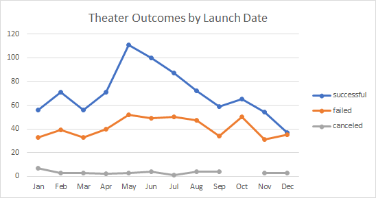
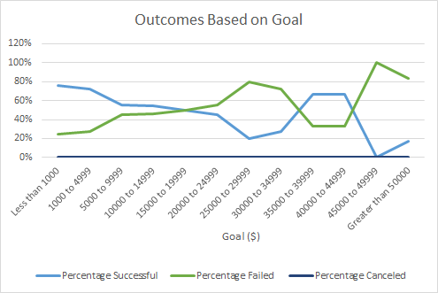

# Kickstarting with Excel

## Overview of Project

### Purpose
The purpose of this analysis is to see if there is a relation between different campaigns launch dates and their funding goals. 

## Analysis and Challenges

### Analysis of Outcomes Based on Launch Date
First, I looked at the launch dates. I generated a pivot table to show the count of successful, failed, and canceled theater performances per month. From the pivot table, I created a line graph showing the count for each successful, failed, and canceled theater performances over time (months). The graph is shown below and titled, "Theater Outcomes by Launch Date."

### Analysis of Outcomes Based on Goals
Second, I looked at the funding goals. I created a chart based on 12 goal ranges. I utilized the COUNTIFS function in Excel to find the number of successful, failed, and canceled plays per goal range. I added a new column to show the total number of projects (# successful + # failed + # canceled) per goal range. Using the total projects column, I was able to generate the percentages of successful, failed, and canceled plays per goal. From the table, I created a line graph showing the percentage for each successful, failed, and canceled theater performances based on the goal ranges. The graph is shown below and titled, "Outcomes Based on Goals."

### Challenges and Difficulties Encountered
I came across no challenges or difficulties during this analysis. However, there are possible ones I could have crossed. One difficulty could have been when using the COUNTIFS function for the analysis of "Outcomes Based on Goals. The function required four ranges for four criteria and two of the criterias I needed to use the goal ranges along with the column range from the Kickstarter worksheet. With four criterias, there is a lot of room for error. If I had flipped the greater than symbol with the less than symbol, then it would have affected the data for that whole goal range. Therefore, also affecting the "Outcomes Based on Goals" graph. What if I made that mistake again or made a similar one after? It could have been a mess. This is why it is so important to double check my work before moving on to a new step. 

## Results

- What are two conclusions you can draw about the Outcomes based on Launch Date?\
  Looking at the "Outcomes Based on Launch Date" graph, theater performances have the most successes in May and June, even in July. I can conclude it is ideal to start theater performances in the months of May, June or July because there is a higher chance it will succeed. Also, in December the count of successful and failed theater performances are very close on the graph. Therefore, I can conclude it is not ideal to start theater performances in Decemeber because it has close to the same chance of succeeding as it does failing.

- What can you conclude about the Outcomes based on Goals?\
  Looking at the "Outcomes Based on Goals" graph, the percentages of succesful plays are high if the goal is less than $5,000. There is a surge in percentages from $35,000 to $44,999, however, the percentages are not as high as they are if the goal is lower than $5,000. Therefore, I can conclude that it is ideal for plays to make a goal of less than $5,000 because there is a higher chance the play will succeed.
  
- What are some limitations of this dataset?

- What are some other possible tables and/or graphs that we could create?\
  One possible table we could have created is how long plays ran for vs. successful, failed, and canceled plays. For example, 3 successful plays ran for 3 months. From there, we could create a chart to show a visual of what is in the chart. This way we can see if the length of plays impact if a show is successful, failed or canceled.
